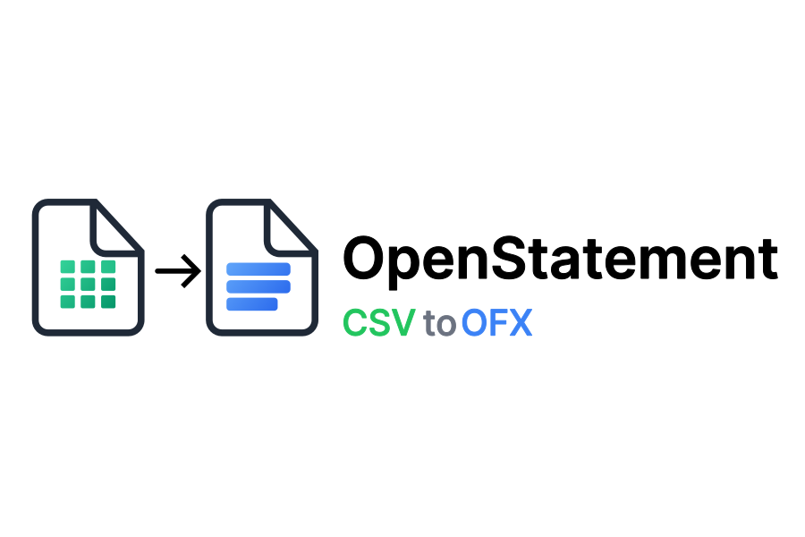
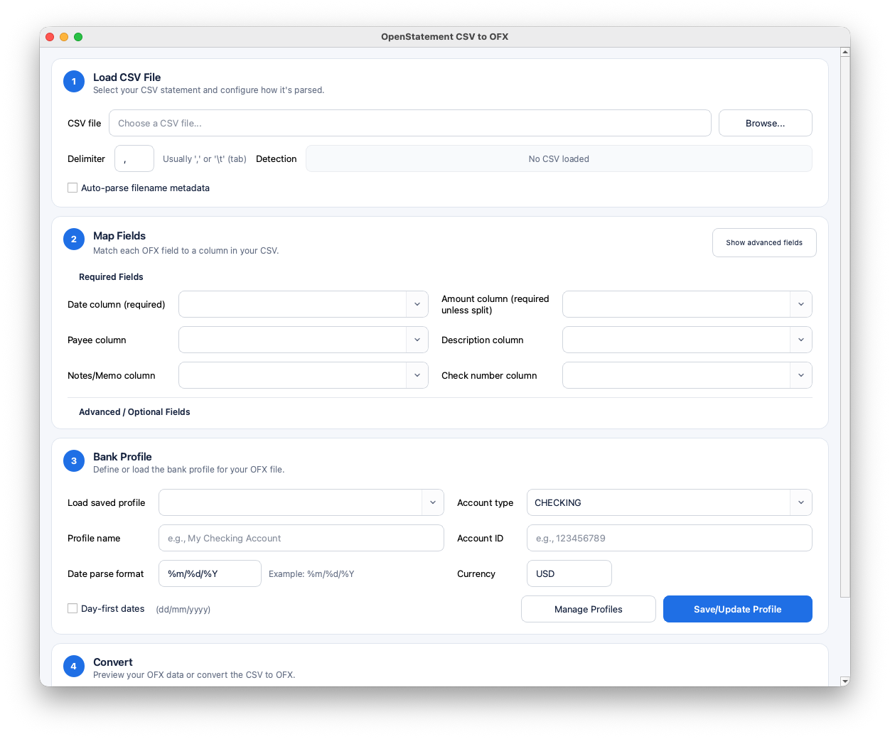
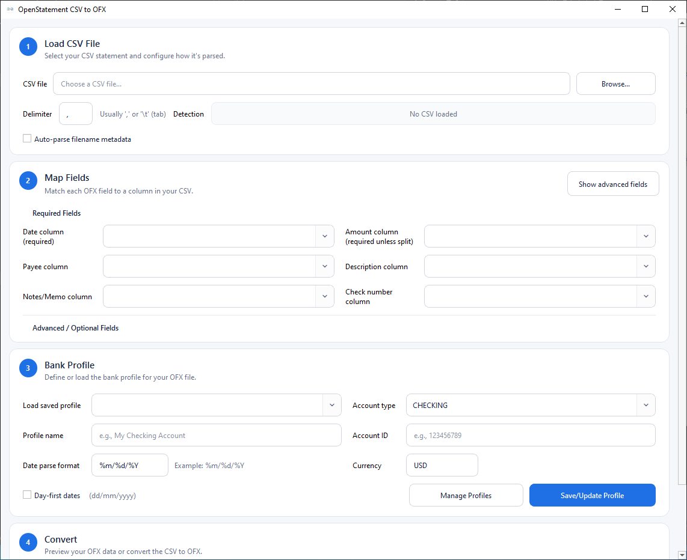
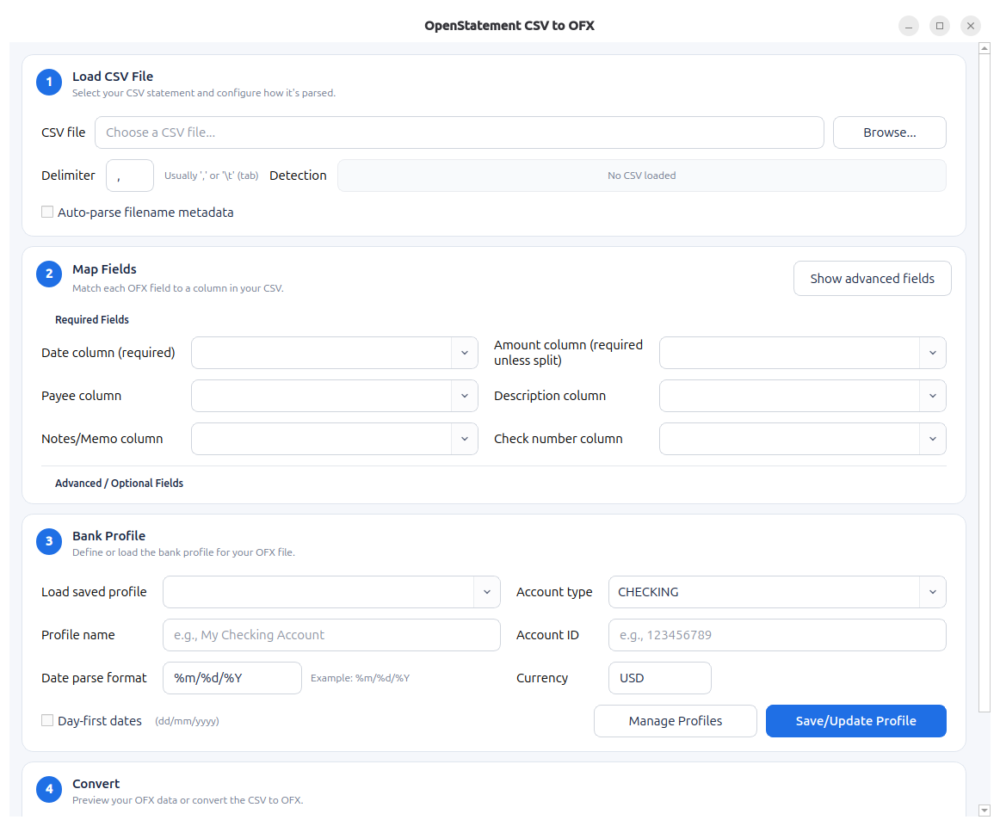

# What is OpenStatement

Desktop app to turn messy bank CSV exports into clean OFX files (powered by `csv2ofx`).

## Why Make This

One of my biggest frustrations with banks in the States is how bad they are at supporting transaction imports into finance software. Outside of something like Quicken, most tools rely on Plaid, MX, or SimpleFin, and those connections are unstable at best. I have spent more time reconnecting integrations than actually balancing my checkbook.

Because of that, I started leaning on manual exports. The problem is a lot of banks only give you a CSV file, and not a great one. It is inconsistent, missing useful data, and usually needs some level of cleanup before you can even try to import it.

I originally wrote a script to deal with this, but even that had issues like duplicate transactions. What stood out to me was that when I imported OFX files from other institutions, things just worked. Fewer issues, fewer duplicates, less friction.

So this project comes from that. OpenStatement takes the messy CSV exports banks give you and turns them into OFX files that actually import cleanly.

*Works with: GnuCash, Actual Budget, Homebank, and YNAB 4.*


## Built on csv2ofx

This project is built on top of `csv2ofx`, an excellent open source tool that handles CSV to OFX conversion reliably.

I had no interest in rewriting that logic. It already does the hard part well.

What was missing was everything around it. Mapping columns across different bank formats, reusing those mappings, and making this usable without touching the command line.

OpenStatement is meant to complement `csv2ofx`, not replace it. It adds a UI, workflow, and some quality-of-life improvements while relying on a proven foundation.

## Features

- Desktop GUI for CSV-to-OFX conversion using `csv2ofx`
- Auto-detects and maps common CSV headers (date, amount, payee, memo, ID, balance, etc.)
- Supports both a single amount column and split debit/credit columns
- Saves reusable bank profiles including mappings, date options, delimiter, and account settings
- Auto-detects likely saved profiles from CSV headers plus parsed filename metadata
- Optional filename metadata parsing with customizable patterns (account, statement date, ending balance)
- Validates mapped columns against the selected CSV before conversion
- Supports bank CSVs containing introductory or summary rows by allowing leading and trailing rows to be ignored
- OFX preview dialog to inspect parsed transactions before writing output
- Adds missing OFX metadata when available (`ACCTID`, `LEDGERBAL/BALAMT`, `LEDGERBAL/DTASOF`)
- Suggests an export filename from the bank profile and the CSV's latest transaction date


## Quick Start

1. Open OpenStatement
2. Load your bank CSV file
3. Map columns (or use auto-detection)
4. Select or save a bank profile
5. Preview the OFX output
6. Export and import into your finance app

## Downloads

Prebuilt releases are available for:

- macOS (11+ / Big Sur or newer)
- Windows (10+)
- Linux (.deb and AppImage, tested with Ubuntu 24.04.4 LTS)

See the [Releases](https://github.com/apowell656/csv2ofx-gui/releases) page for the latest builds.


## Optional Filename Metadata Parsing

If a bank CSV omits account ID or statement summary fields, OpenStatement can parse metadata from the CSV filename.

The `Date parse format` field in the Bank Profile section is passed through to `csv2ofx`, so it accepts common
`strftime`-style date formats such as `%m/%d/%Y`, `%d/%m/%Y`, and `%Y-%m-%d`. If the CSV uses ambiguous numeric
dates, enable `Day-first dates` when appropriate.

Default pattern:

```text
{account_name}_{account_id}_{statement_date}_{ending_balance}.csv
```

Example:

```text
Checking_53904793_2026-04-24_1520.44.csv
```

Rules:

- `account_id` accepts letters, digits, `_`, and `-`
- `{last8}` is still supported as a backward-compatible alias if you already have older saved patterns
- `statement_date` accepts common formats such as `YYYY-MM-DD`, `YYYY_MM_DD`, `YYYYMMDD`, `MM-DD-YYYY`, and `DD-MM-YYYY`
- `ending_balance` supports negative values (for example `-120.55`)

Ambiguous filename dates such as `01-02-2026` are interpreted month-first unless the first number is greater than 12.

The feature is optional. In the UI, enable `Auto-parse filename metadata`, review/edit detected values, then convert. Source priority is:

1. CSV/OFX values already present
2. Filename metadata fields
3. Manual profile fallback values


## Development Setup

For contributors who want to modify the repo:

```bash
python3 -m venv .venv
source .venv/bin/activate
python -m pip install --upgrade pip
pip install -e .
```

On Windows PowerShell, activate the repo virtualenv with:

```powershell
.venv\Scripts\Activate.ps1
```

If PowerShell blocks script execution, run:

```powershell
Set-ExecutionPolicy -Scope Process Bypass
.venv\Scripts\Activate.ps1
```

Install development/test dependencies:

```bash
pip install -e ".[dev]"
```

Run tests:

```bash
.venv/bin/pytest -q
```

## Project Layout

```text
openstatement/
  app.py                     # Application entry function
  config/
    constants.py             # App/UI constants
  models/
    profile.py               # BankProfile + profile persistence
  services/
    conversion.py            # csv2ofx conversion + preview formatting
  ui/
    main_window.py           # Main window composition
    sections/
      layout.py              # UI widgets/layout assembly
      csv.py                 # CSV loading + auto mapping
      profile.py             # Profile load/save/validation
      conversion.py          # Convert/preview UI flow
openstatement_app.py         # Thin launcher script
```
## Build with PyInstaller

Use the existing spec file from the repo root:

For macOS icon support, generate `openstatement/build_assets/icons/openstatement_logo.icns` from your
`openstatement/build_assets/icons/icon.iconset` first:

```bash
iconutil -c icns openstatement/build_assets/icons/icon.iconset -o openstatement/build_assets/icons/openstatement_logo.icns
```

Windows uses `openstatement/build_assets/icons/openstatement_logo.ico` automatically from the spec.

```bash
.venv/bin/pyinstaller OpenStatement.spec
```

Build outputs:

- macOS: `dist/OpenStatement.app`
- Linux: `dist/OpenStatement/`
- Windows: `dist/OpenStatement.exe`

To rebuild cleanly:

```bash
rm -rf build dist
.venv/bin/pyinstaller --clean OpenStatement.spec
```

## Linux Packaging

Build Linux release binaries from inside Linux, not from Windows or macOS. If you are using an Ubuntu VM, clone the repo
there, confirm the app runs from source, then build from that checkout.

From the repo root in the Ubuntu VM:

```bash
sudo apt update
sudo apt install -y \
  python3-venv \
  python3-pip \
  build-essential \
  desktop-file-utils \
  fakeroot \
  wget \
  file
```

AppImages also need FUSE on the machine that runs them. Install `libfuse2` on Ubuntu 22.04, or `libfuse2t64` on newer
Ubuntu releases if `libfuse2` is unavailable.

Then build both quick release artifacts:

```bash
bash packaging/linux/build_release.sh
```

The script reads the release version from `pyproject.toml` by default:

```toml
[project]
version = "..."
```

Outputs:

```text
dist/packages/openstatement_<version>_<arch>.deb
dist/packages/OpenStatement-<version>-<arch>.AppImage
```

To override the version without editing `pyproject.toml`:

```bash
bash packaging/linux/build_release.sh <version>
```

Test the `.deb` locally:

```bash
sudo apt install "$(ls dist/packages/openstatement_*_*.deb | tail -n 1)"
openstatement
```

Test the AppImage locally:

```bash
APPIMAGE="$(ls dist/packages/OpenStatement-*-*.AppImage | tail -n 1)"
chmod +x "$APPIMAGE"
"$APPIMAGE"
```

If the AppImage prints a FUSE error, install the AppImage runtime dependency and try again:

```bash
sudo apt install libfuse2
```

On newer Ubuntu releases where `libfuse2` is unavailable, use:

```bash
sudo apt install libfuse2t64
```

You can also run without FUSE as a fallback:

```bash
APPIMAGE="$(ls dist/packages/OpenStatement-*-*.AppImage | tail -n 1)"
APPIMAGE_EXTRACT_AND_RUN=1 "$APPIMAGE"
```

Upload both files from `dist/packages/` to the GitHub release.

- Build on the oldest Ubuntu version you want to support. AppImages and PyInstaller builds are usually more portable
  when built on an older still-supported distro.
- The script downloads `appimagetool` into `packaging/tools/` if it is not already there.
- The `.deb` integrates with Ubuntu menus and package management. The AppImage is a single portable file.

## Run

Use the project virtualenv to keep source and packaged UI behavior consistent.

From the repo root:

```bash
.venv/bin/python openstatement_app.py
```

Or:

```bash
.venv/bin/python -m openstatement
```

From the parent directory of the repo:

```bash
./openstatement/.venv/bin/python -m openstatement
```

After install (`pip install -e .`):

```bash
openstatement
```

## Troubleshooting

If you see:

`qt.qpa.plugin: Could not find the Qt platform plugin "cocoa"...`

reinstall PySide in your active venv:

```bash
python -m pip uninstall -y PySide6 PySide6_Addons PySide6_Essentials shiboken6
python -m pip install --no-cache-dir "PySide6==6.11.0"
```

Quick check:

```bash
python -c "from PySide6.QtWidgets import QApplication; app=QApplication([]); print('qapp ok')"
```

## Screenshots





